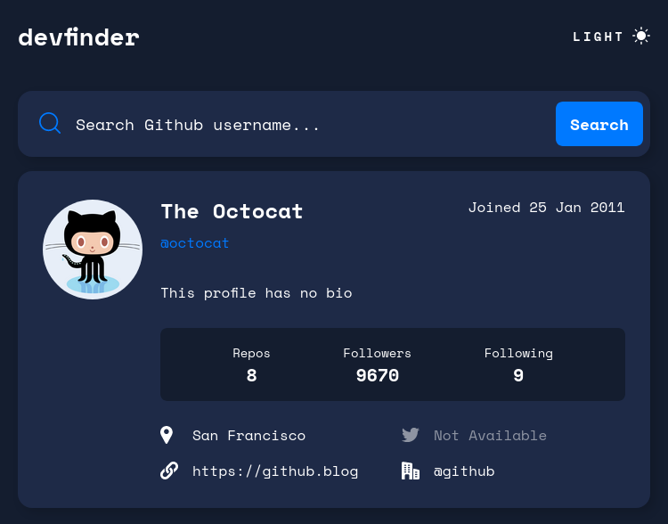
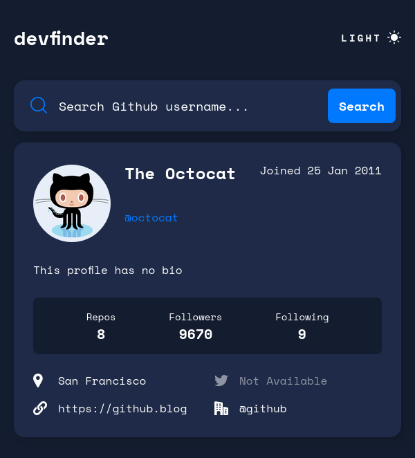
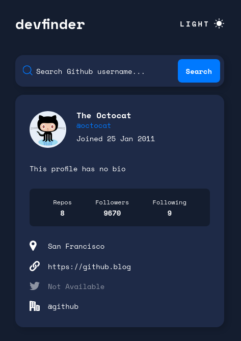

# Frontend Mentor - GitHub user search app solution

This is a solution to the [GitHub user search app challenge on Frontend Mentor](https://www.frontendmentor.io/challenges/github-user-search-app-Q09YOgaH6). Frontend Mentor challenges help you improve your coding skills by building realistic projects.

## Table of contents

- [Overview](#overview)
  - [The challenge](#the-challenge)
  - [Screenshot](#screenshot)
  - [Links](#links)
- [My process](#my-process)
  - [Built with](#built-with)
  - [What I learned](#what-i-learned)
  - [Continued development](#continued-development)
- [Author](#author)

## Overview

### The challenge

Users should be able to:

- View the optimal layout for the app depending on their device's screen size
- See hover states for all interactive elements on the page
- Search for GitHub users by their username
- See relevant user information based on their search
- Switch between light and dark themes
- **Bonus**: Have the correct color scheme chosen for them based on their computer preferences. _Hint_: Research `prefers-color-scheme` in CSS.

### Screenshot





### Links

- Solution URL: [Solution URL](https://www.frontendmentor.io/solutions/responsive-github-user-search-using-styled-components-and-react-H9GuvHJoSt)
- Live Site URL: [Github URL](https://loganf50.github.io/github-user-search/)

## My process

### Built with

- Flexbox
- CSS Grid
- Mobile-first workflow
- [React](https://reactjs.org/) - JS library
- [Styled Components](https://styled-components.com/) - For styles

### What I learned

- async/await
  - used to get user data from github api

```js
const handleUserSearch = async (username: string) => {
  const response = await fetch(`${baseURL}${username}`);
  const data = await response.json();
  if (response.ok) {
    setUserData(getUserDataFromJSON(data));
  } else {
    setHasError(true);
  }
};
```

- how to change theme based on a user's preference

```js
useEffect(() => {
  window.matchMedia &&
  window.matchMedia("(prefers-color-scheme: light)").matches
    ? setCurrentTheme(Themes.light)
    : setCurrentTheme(Themes.dark);
}, []);
```

- useEffect
  - to display user info on first load

```js
useEffect(() => {
  handleUserSearch("octocat");
}, []);
```

### Continued development

- grid
  - I feel like I am finding easier solutions when I would take forever trying to do the same things in flex (such as wrapping the links on larger screens)

## Author

- Frontend Mentor - [@LoganF50](https://www.frontendmentor.io/profile/LoganF50)
